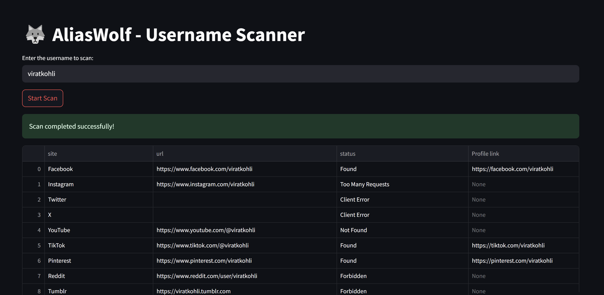

<h1 align="center">🐺 AliasWolf</h1>
<p align="center">
    <i>Find usernames across the web like a true hunter. Fast. Precise. Powerful.</i>
</p>

<p align="center">
  <a href="https://aliaswolf.streamlit.app/">
    
  </a>
  <a href="https://github.com/OnlyVenkatadanush/Alias-wolf/stargazers">
    
  </a>
  <a href="https://github.com/OnlyVenkatadanush/Alias-wolf/fork">
    
  </a>
    
[](https://github.com/OnlyVenkatadanush/Alias-wolf/stargazers)
[](https://github.com/OnlyVenkatadanush)
</p>


---

## 🚀 What is AliasWolf?

AliasWolf is a blazing fast **username scanner** that checks if a given username exists across multiple platforms — like social media, forums, websites — and provides you with the direct **profile link**.  
Built with love using **Streamlit**, **Python Asyncio**, and **aiohttp**.
[](https://aliaswolf.streamlit.app/)
---

## 🧩 Features

- 🔎 Scan over 100+ platforms in seconds
- ⚡ Super-fast with asynchronous requests
- 📄 Download results as CSV, Excel, or PDF
- 🎯 Shows direct Profile Links if username found
- 🛡️ Error-handling for timeouts, forbidden access, etc.
- 🧹 Clean and simple UI (built with Streamlit)
- 📦 Ready to deploy on Streamlit Cloud

---
## Applications:
Username Availability Check: Quickly check if a username is available across multiple social media platforms.

Profile Link Retrieval: Automatically retrieve direct profile links for available usernames.

User Research: Helpful for researching social media profiles or accounts for brand or personal use.

Brand & Domain Name Validation: Ideal for businesses to check the availability of brand names on various platforms.

Security Research: Assess the consistency of usernames and profiles across multiple websites for identity verification.

---
## 🛠️ Usage

1. **Enter a Username**: Type the desired username in the input field.
2. **Click 'Start Scan'**: The app will scan popular platforms to check the username's availability.
3. **View Results**: The results are displayed in a table, showing the platform, status, and direct profile link (if available).
4. **Download Results**: You can download the scan results in CSV, Excel, or PDF formats.
---
[](https://aliaswolf.streamlit.app/)


---

## 📸 Screenshots
# scanned results

# Download the results


---

## 🛠️ Tech Stack

- **Frontend:** Streamlit
- **Backend:** Python (asyncio, aiohttp, pandas)
- **Utilities:** ReportLab for PDF export
- **Hosting:** Streamlit Cloud

---

## 🏗️ How to Run Locally

1. Clone the repository:

```bash
git clone https://github.com/OnlyVenkatadanush/Alias-wolf.git
cd Alias-wolf
1.Install dependencies:
pip install -r requirements.txt
2.Run the Streamlit app:
streamlit run app.py
```
## 🎯 Future Improvements
- *Add more platforms for username checking.*

- *Integrate user authentication to track previous scans.*

- *Add support for more complex username patterns and checks.*

- *Incorporate more data visualizations.*
